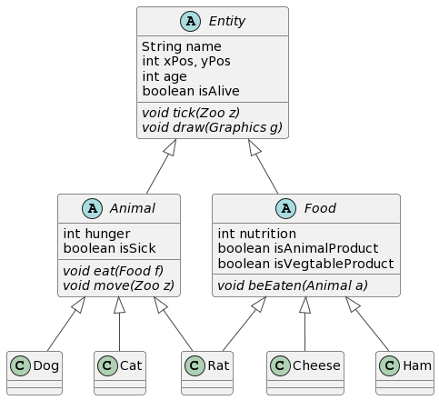

# The Zoo Project

> Link: [Java Abstract Classes](https://docs.oracle.com/javase/tutorial/java/IandI/abstract.html)

Welcome to the Land of the Wild (a zoo). In this zoo, there are two kinds of inhabitants, **animals** and **food**. Animals, like the humble `Dog`, the unhumble `Cat`, and the friendly neighborhood `Rat`, are capable of two actions: `eat` and `move`. Additionally, animals have a intrinsic desire to seekout food, called `hunger`, and they can also get sick! Food, on the other hand, can really only do one thing: `beEaten`.

As you may have guessed, we will use inheritance to add structure to our Zoo program. For example, a cat is an animal so `Cat` will extend `Animal`. Then any methods we define in `Animal` can be used in `Cat`.


## Why Use Abstract Classes?

There's just one problem. We all agree animals can `eat`, so we will add that method to the `Animal` class for `Cat` to inherit. But what does an *animal* eat? Not a cat or a dog, but an animal *in the abstract.* Every animal eats different things. It's not clear how we should implement `eat` in the parent class even though surely every animal *can* `eat`.


```java
Animal a = new Animal();
a.eat(); // its not clear what this should do
```

The solution is abstract classes. Of course every animal can eat, but the implementation details of how the animal eats depends on the specific animal. In this case we say that the method `eat` is ***abstract*** (this is a Java keyword). We can defer the implementation of an abstract method for the child class to decide.

Furthermore, since the concrete child class actually inherits the method from its abstract parent class, the child class MUST implement it (otherwise our code will not compile). Therefore, at runtime our child class is **guranteed** to have behavior associated with the inherited method, unlike the parent class, which by definition has no behavior associated with the abstract method.

Any class that has at least one abstract method, must itself be abstract. ***It isn't possible to directly instanciate an abstract class*** because, going back to the example above, it would be unclear what to do if we were to call the abstract method inside the class.

Legal:
```java
Cat cat = new Cat();
cat.eat(); // Cat inherits eat() from Animal
```

Also legal:
```java
Animal cat = new Cat();
cat.eat(); // the underlying Animal object was instanciated using new Cat() and therefore has a valid eat() method
```

Illegal:
```java
Animal cat = new Animal(); 
cat.eat(); // undefined behavior
```

Here's what our abstract class `Animal` might look like. ***Our final implementation will actually have more complexity than this example.***

```java
public abstract class Animal {
    protected int hunger;
    protected boolean isSick;

    public Animal() {
        this.hunger = 0;
        this.isSick = false;
    }

    // abstract methods have a ";" instead of "{ }" with code
    public abstract void eat(); 
    public abstract void move();
}
```
## Required Class Heiarchy

Abstract methods are identified in *italics*! 



## Provided Classes
- ### `Zoo` extends `JPanel`
    - Feel free to take a look inside to get a better idea of how it works
    - #### Useful variables:
        - `Zoo.rand` (static)
            - Use this to get any random number in other classes
        - `Zoo.ZOO_ROW`, `Zoo.ZOO_COLS`, `Zoo.SCALE` (static)
            - The zoo is a grid of size ZOO_ROWS x ZOO_COLS
            - The JFrame renders a screen of size (SCALE * ZOO_COLS) x (SCALE * ZOO_ROWS)
    - #### Useful methods:
        - `ArrayList<Entity> at(int x, int y)`
            - Return a list of all Entities at x,y in the zoo grid
        - `void add(Entity e)`
            - Adds an Entity to the grid
            - Places at the x,y cordinates specified in the Entitiy
        - `int wrap(int val, int thresh)` (static)
            - If `val` is greater than or equal to `thresh`, it wraps around starting at 0
            - If `val` is less than zero, it wraps around statring at `thresh - 1`

## Required Abstract Classes
- ### `Entity`
    - #### Properties
        - Its name, e.g., "Cat Howl", "Ham #37"
        - Its age in ticks
        - Its coordinates on the Zoo (not display) grid
        - Whether or not it is "alive"
            - `Zoo` will remove entities that are not alive on the next tick
            - Animals are considered alive until they die.
            - Food is considered alive until it is eaten or rots away.
    - #### `void draw(Graphics g)` (abstract)
        - Use this method to draw the entity, food or animal, on the screen. `Zoo` calls the `draw` method of each `Entity` once per tick. 
    - #### `void tick(Zoo z)` (abstract)
        -  Use this method to increase the age of the entity and do any other logic that happens at regular intervals, such as `move`ing. `Zoo` also calls the `tick` method of each `Entity` once per tick.
- ### `Animal` extends `Entity`
    - #### Properties
        - The hunger of the animal (minimum 0, no maximum)
        - Whether or not the animal is sick
    - #### `void eat(Food f)` (abstract)
        - Call this method when the animal is on the same cell as a food it **might** eat. Decide here if the animal will in fact eat the food.
        - If you decide to eat the food, it's a good idea to call `f.beEaten(this)` (passing *this* Animal object to the food) at the end of `eat`.
    - #### `void move(Zoo z)` (abstract)
        - Call this method when the animal might move during the current tick. Decide here if the animal will in fact move.
        - Passing in the `Zoo` object grants access to the Entities at a particular position, a list of which can be obtained using `z.at(x, y)`.
- ### `Food` extends `Entity`
    - #### Properties
        - Whether or not the food is an animal product
        - Whether or not the food is a vegtable product
        - The nutritional value of the food
    - #### `void beEaten(Animal a)` (abstract)
        - Call this method from the `eat` method once you are sure the Animal will eat the food

- ### Print the following information to the console:
    - When an animal is born, e.g., "Cat Alice was born today!" 
    - When an animal dies, e.g., "Cat Dalice died of old age. R.I.P."
    - When an animal gets sick, e.g., "Dog Henry got food poisioning from eating Ham #37."
    - When a food is eaten, e.g., "Cat Howl ate Ham #37, gaining 15 nutrition!"
    - When a food rots away, e.g., "Cheese #6 got old and rotted away."

## Required Concrete Classes

Each concrete class must implement the abstract methods from *all* parent classes, in addition to any other code necessary to create the functionality described below.

- ### `Cat` extends `Animal`
    - A cat has 9 lives; that is, **it can die a full 9 times before its dead for good.**
        - After 500 ticks a cat has a 1% chance of dying per tick, 10% if the cat is sick
        - If a cat is at all sick, it has at minimum a 0.1% chance of dying per tick
    - When its hunger is greater than 25, a cat has a 99% chance to eat any food it touches that is an animal product ONLY
    - In general cats will move in a random direction once every 10 ticks
        - If a cat would move into the cell of another animal, they will instead move in the opposite direction
        - Exception: a cat will always move towards adjacent food including food that is also an animal (rats)
            - This is the case even if the cat is not hungry (hunting instinct)
    - Two cats in an adjacent cells have a 10% chance of spawning a new cat nearby

- ### `Dog` extends `Animal`
    - A dog only has 1 life, but it lives for longer than a cat
        - After 1000 ticks a dog has a 0.1% chance of dying per tick, 1% if the dog is sick
    - When its hunger is greater than 50, a dog has a 100% chance to eat any food it touches that is an animal product
        - Otherwise, a dog has a 1% chance to eat any animal product food it touches
    - Dogs have a preferred direction, initially random, and one of either north, south, east, or west
        - When a dog is in a cell adjacent to another dog, there is a 25% chance for the adjacent dog to orient their preferred direction to that of the other dog
        - Dogs have a 75% chance of moving in their preferred direction (otherwise random) every 15 ticks
    - When a dog dies, it has a 50% chance to spawn one new dog and a 25% chance to spawn a second new dog nearby

- ### `Rat` extends `Animal` AND `Food`
    - ***NOTE: I messed up here. Multiple inheritance is not possible in Java. It is YOUR choice whether Rat inherits from Animal or Food.***
    - A rat has 1 life and desparately tries to keep it
        - After 500 ticks, a rat has a 1.5% chance of dying per tick, 20% if the rat is sick
        - If a rat is at all sick, it has at minimum a 1% chance of dying per tick
    - A rat's hunger can never fall below 20
        - A rat will always eat cheese
        - A rat will eat anything else ONLY IF its hunger is above 50
    - Rats move in a consistent direction once every 5 ticks
        - Every 40-60 ticks, a rat randomly changes the direction they move
        - If a rat is ever adjacent to cheese, it will move towards the cheese
    - Every 50 ticks, there is a 10% chance of a rat spawning
    - Rats do not expire and are always a nutritious meal on the order of deceasing hunger by 10 when eaten
        - Rats can only be eaten once
        - A rat dies when eaten

- ### `Cheese` extends `Food`
    - Cheese can be eaten 3 times
        - The first time, it decreases hunger by 10 nutrition, the second time 8 nutrition, the third time 5 nutrition.
    - After 400 ticks, cheese has a 1% chance of expiring per tick, at which point it will make an animal sick
        - Eating expired cheese neither increases nor decreases hunger
        - Rats are immune to cheese sickness and will not get sick if they eat expired cheese
    
- ### `Ham` extends `Food`  
    - Ham can only be eaten once
        - Eating ham decreases hunger by 15 nutrition
    - Ham expires and will make an animal sick if eaten after exactly 200 ticks
        - Eating expired ham increases hunger by 5 nutrition

##  Tips
- Start by creating the abstract class heiarchy. Then focus on implementing one concrete class at a time.
- Try to think about how you would make a similar program *without* using abstract classes. How are abstract classes helping us here?
- Why is it useful to have **both** the `eat(Food f)` AND the `beEaten(Animal a)` methods?


